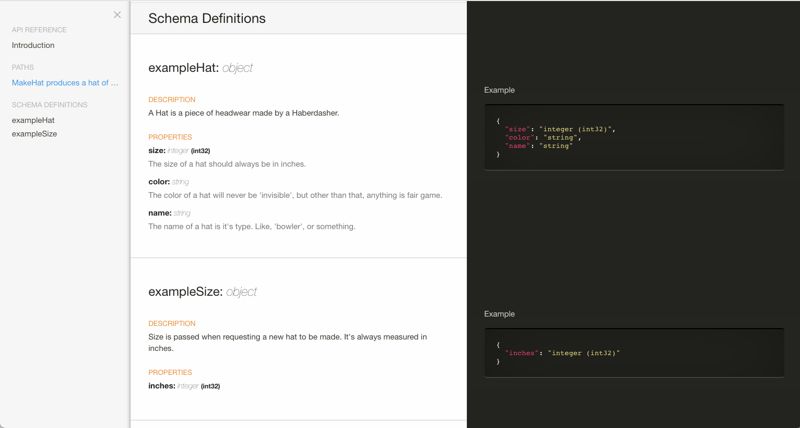
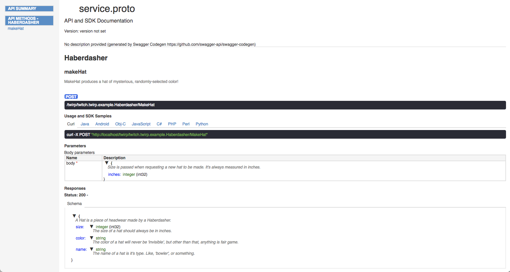

# Twirp Swagger Generator

NOTE: This is new and barely tested. If you find problems, please open an issue :)

Also Note: None of the clients or servers generated from swagger support protobuf. Only json.

Table of Contents
=================

  * [What is this?](#what-is-this)
  * [Usage](#usage)
  * [Other uses](#other-uses)
  * [Full Example](#full-example)
      * [Generating the swagger file](#generating-the-swagger-file)
        * [Output](#output)
      * [Generating Clients](#generating-clients)
      * [Using the Clients](#using-the-clients)
        * [JavaScript](#javascript)
        * [Python](#python)
        * [Go](#go)
      * [Generating documentation](#generating-documentation)
        * [Spectacle](#spectacle)
        * [swagger-codegen (html2 language)](#swagger-codegen-html2-language)
      * [Generating servers](#generating-servers)
  * [Thanks](#thanks)

## What is this?

A plugin for the awesome twirp - https://github.com/twitchtv/twirp

It is a protobuf generator that creates a swagger file for your twirp services.

This swagger file can then be used to generate documentation and clients for many many languages.


## Usage

`go get github.com/elliots/protoc-gen-twirp_swagger`

then run as part of your usual protoc generation phase


```bash
protoc --go_out=. \
       --twirp_out=. \
       --twirp_swagger_out=. \
       ./test.proto
```

## Other uses

You can import the swagger file into a lot of other tools and services.

If you find any good ones, add an issue so we can list them here.

## Full Example

Proto file taken from the twirp example.
All scripts/clients/docs are in [example](example)

### Generating the swagger file

`./generate-swagger.sh` will create service.swagger.json


#### Output
```json

{
  "swagger": "2.0",
  "info": {
    "title": "service.proto",
    "version": "version not set"
  },
  "schemes": [
    "http",
    "https"
  ],
  "consumes": [
    "application/json"
  ],
  "produces": [
    "application/json"
  ],
  "paths": {
    "/twirp/twitch.twirp.example.Haberdasher/MakeHat": {
      "post": {
        "summary": "MakeHat produces a hat of mysterious, randomly-selected color!",
        "operationId": "MakeHat",
        "responses": {
          "200": {
            "description": "",
            "schema": {
              "$ref": "#/definitions/exampleHat"
            }
          }
        },
        "parameters": [
          {
            "name": "body",
            "in": "body",
            "required": true,
            "schema": {
              "$ref": "#/definitions/exampleSize"
            }
          }
        ],
        "tags": [
          "Haberdasher"
        ]
      }
    }
  },
  "definitions": {
    "exampleHat": {
      "type": "object",
      "properties": {
        "size": {
          "type": "integer",
          "format": "int32",
          "description": "The size of a hat should always be in inches."
        },
        "color": {
          "type": "string",
          "description": "The color of a hat will never be 'invisible', but other than\nthat, anything is fair game."
        },
        "name": {
          "type": "string",
          "description": "The name of a hat is it's type. Like, 'bowler', or something."
        }
      },
      "description": "A Hat is a piece of headwear made by a Haberdasher."
    },
    "exampleSize": {
      "type": "object",
      "properties": {
        "inches": {
          "type": "integer",
          "format": "int32"
        }
      },
      "description": "Size is passed when requesting a new hat to be made. It's always\nmeasured in inches."
    }
  }
}

```

### Generating Clients

`./generate-clients.sh` will create clients for C#, go, java, javascript, lua, python, and ruby (many more are available)

### Using the Clients

#### JavaScript

```javascript

var Serviceproto = require('./javascript');

var devClient = new Serviceproto.ApiClient();
devClient.basePath = 'http://localhost:8080';

var api = new Serviceproto.HaberdasherApi(devClient);

var body = new Serviceproto.ExampleSize(); // {ExampleSize} 
body.inches = 20;

var callback = function(error, data, response) {
  if (error) {
    console.error(error);
  } else {
    console.log('API called successfully. Returned data: ', data);
  }
};
api.makeHat(body, callback);

```

#### Python

```python

from __future__ import print_function
import time
import swagger_client
from swagger_client.rest import ApiException
from pprint import pprint
# create an instance of the API class
cfg = swagger_client.Configuration()
cfg.host="http://localhost:8080"
client = swagger_client.ApiClient(cfg)
api_instance = swagger_client.HaberdasherApi(client)
body = swagger_client.ExampleSize() # ExampleSize | 
body.inches = 20

try:
    # MakeHat produces a hat of mysterious, randomly-selected color!
    api_response = api_instance.make_hat(body)
    pprint(api_response)
except ApiException as e:
    print("Exception when calling HaberdasherApi->make_hat: %s\n" % e)

```


#### Go

Note: You almost certainly want to use the twirp client, not the swagger one. No protobuf here.

```go

package main

import (
	"context"
	"fmt"

	"github.com/elliots/protoc-gen-twirp_swagger/example/clients/go"
)

func main() {
	cfg := swagger.NewConfiguration()
	cfg.BasePath = "http://localhost:8080"
	client := swagger.NewAPIClient(cfg)

	hat, resp, err := client.HaberdasherApi.MakeHat(context.Background(), swagger.ExampleSize{
		Inches: 20,
	})
	if err != nil {
		panic(err)
	}

	fmt.Printf("Got response code: %d hat: %v", resp.StatusCode, hat)
}

```


### Generating documentation

`./generate-documentation.sh`

#### Spectacle



#### swagger-codegen (html2 language)




### Generating servers

`./generate-documentation.sh`

Generates servers for rust and node.js.

See [example/servers](example/servers)

## Thanks

Based on: https://github.com/grpc-ecosystem/grpc-gateway/tree/master/protoc-gen-swagger (Like, 99.5% based on.)

Table of contents created by [gh-md-toc](https://github.com/ekalinin/github-markdown-toc)